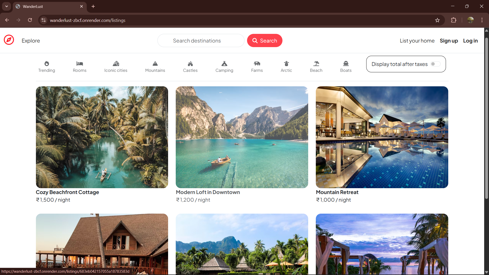
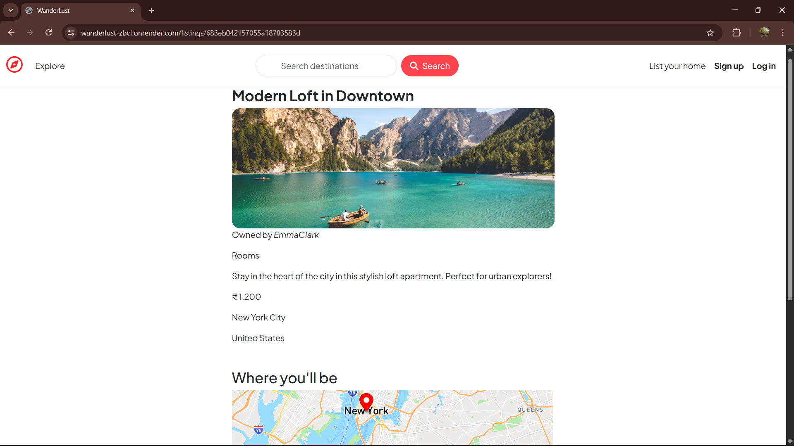

# 🏕️ Wanderlust – Full-Stack Lodging Web App

[](https://github.com/Nikunj-Mehta/Wanderlust/stargazers)
[](https://github.com/Nikunj-Mehta/Wanderlust/network/members)
[](LICENSE)
[](https://wanderlust-zbcf.onrender.com/)
[](https://nodejs.org/)
[](https://www.mongodb.com/)

Wanderlust is a **full-stack lodging and travel booking application** inspired by Airbnb.  
It allows users to explore, list, and manage rental properties with **map integration, authentication, and a responsive design**.  

---

## 🚀 Tech Stack
**Frontend:** HTML, CSS, EJS  
**Backend:** Node.js, Express.js  
**Database:** MongoDB, MongoDB Atlas  
**APIs & Services:** Mapbox API, Render Deployment  
**Architecture:** MVC, OOP Principles

---

## ✨ Features
- 🔐 **Authentication** – Secure login/signup with hashed passwords.
- 🏠 **Property Management** – Add, edit, and delete property listings.
- 🗺️ **Interactive Maps** – Integrated Mapbox API for location visualization.
- 📱 **Responsive UI** – Works on mobile, tablet, and desktop.
- 🌐 **Cloud Deployment** – Hosted on Render, DB on MongoDB Atlas.

---

## 🔗 Live Demo
👉 [View Live Project](https://wanderlust-zbcf.onrender.com/)

---

## 📸 Screenshots

**Home Page**


**Property Details**


---

## 🛠️ Installation

```bash
# Clone the repository
git clone https://github.com/Nikunj-Mehta/Wanderlust.git
cd Wanderlust

# Install dependencies
npm install

# Set up environment variables
#   - Copy `.env.example` → `.env`
#   - Fill in your credentials (MongoDB, Mapbox, Cloudinary, SECRET)

# Run the application
npm start

```

## 📂 Folder Structure
```
Wanderlust/
├── models/           # Mongoose schemas
├── routes/           # Express routes
├── controllers/      # App logic
├── public/           # Static assets (CSS, JS, images)
├── views/            # EJS templates
├── app.js            # Main server file
└── package.json
```

## 🙌 Acknowledgements
- Mapbox API – For interactive maps → https://www.mapbox.com/
- MongoDB Atlas – Cloud database hosting → https://www.mongodb.com/cloud/atlas
- Render – App hosting → https://render.com/
- Inspired by Airbnb and guided by the Apna College MERN course

## 🧑‍💻 Author  
Developed by **[Nikunj Mehta](https://github.com/Nikunj-Mehta)** 🚀 